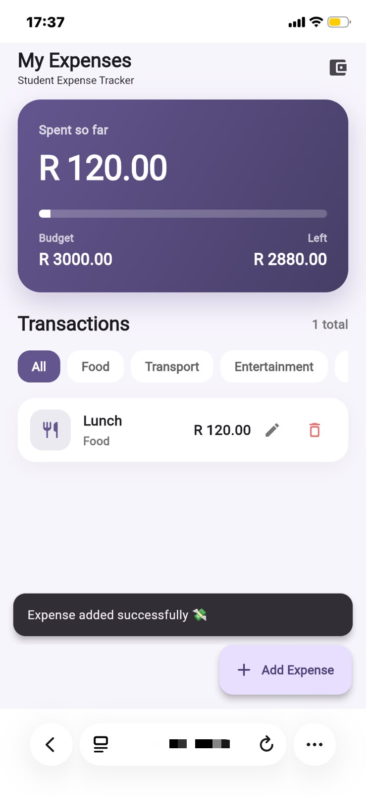
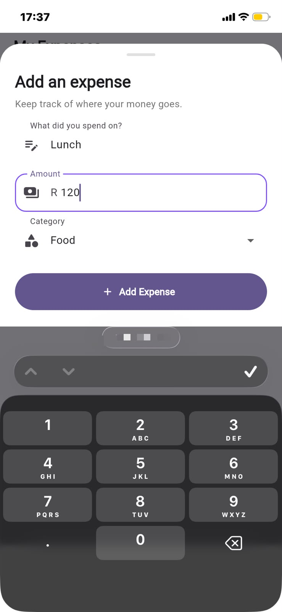
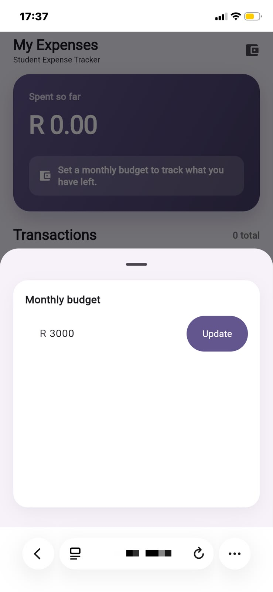
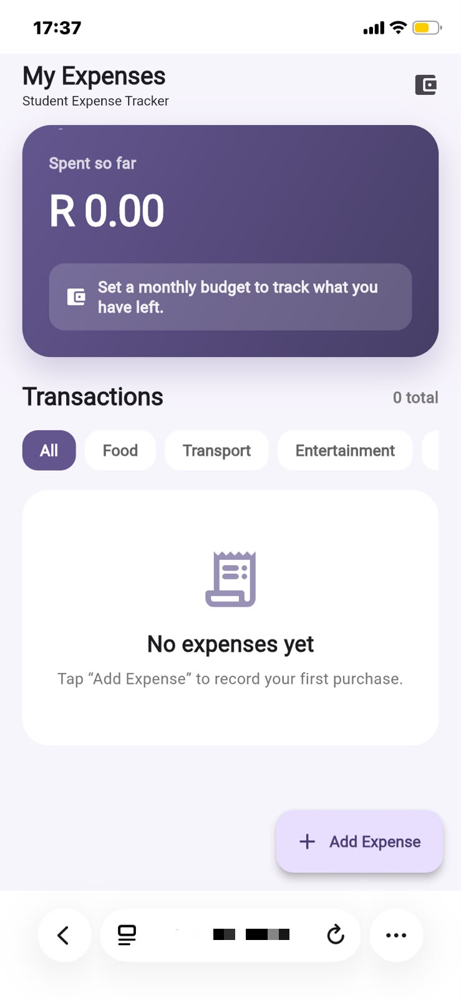

# 🎒 Student Expense Tracker

<p align="center">
  
</p>

<h3 align="center">Track your money. Understand your spending. Stay in control.</h3>

<p align="center">
  A beginner-friendly Flutter application built to help students record, manage, and understand their everyday expenses.
</p>

<p align="center">
  
  
  
  
  
</p>

---

## 🌱 About the Project

**Student Expense Tracker** is a personal Flutter project designed around a simple problem:

> **Where is all my money going?**

The application allows students to record their daily expenses, organise them into categories, calculate their total spending, manage a budget, filter transactions, and make changes to previously recorded expenses.

The project began as a **Dart command-line application** and was later transformed into a **Flutter application**, introducing a graphical user interface while keeping the original Dart business logic.

The application can run in a desktop browser and can also be accessed from a mobile device, including an **iPhone**, through a local Flutter web server.

Expenses are also stored locally using **SharedPreferences and JSON**, meaning recorded expenses remain available after the application is refreshed or reopened.

### 🎯 Project Evidence

This repository contains:

- ✅ Complete Flutter and Dart source code
- ✅ Individual Git commit history
- ✅ Unit and widget tests
- ✅ Application screenshots
- ✅ Mobile browser testing on an iPhone
- ✅ Project documentation
- ✅ Persistent local expense storage

---

## ✨ What Can It Do?

| Feature                      | Description                                                                       |
| ---------------------------- | --------------------------------------------------------------------------------- |
| 💰 **Add Expenses**          | Record an expense with a description, amount and category                         |
| 📊 **Track Spending**        | Automatically calculate total expenses                                            |
| 🏷️ **Categories**           | Organise expenses into useful spending categories                                 |
| 🔎 **Category Filtering**    | Filter transactions by expense category                                           |
| ✏️ **Edit Expenses**         | Update an existing expense                                                        |
| 🗑️ **Delete Expenses**      | Remove expenses that are no longer needed                                         |
| 🧮 **Budget Logic**          | Calculate spending and remaining budget                                           |
| 💳 **Budget Card**           | Display budget information in a reusable UI component                             |
| 🧾 **Expense Cards**         | Display individual expenses using reusable cards                                  |
| 💾 **Persistent Storage**    | Save expenses locally so they survive refreshes                                   |
| 🌐 **Web App**               | Run the application in a web browser                                              |
| 📱 **Mobile Browser Access** | Access the running application from an iPhone or other device on the same network |
| 🧪 **Automated Testing**     | Maintain application behaviour with unit and widget tests                         |

### Categories

```text
🍔 Food
🚌 Transport
🎬 Entertainment
📚 Study
📦 Other
```

---

## 🖥️ The Application

The Student Expense Tracker provides a clean and responsive interface for managing a monthly budget and everyday expenses.

The screenshots below were captured while running the **Flutter Web application on an iPhone through Safari**.

### 💜 Expense Dashboard

The main dashboard displays the amount spent, monthly budget, remaining balance, transaction history, categories, and options to edit or delete expenses.

<p align="center">
  
</p>

<p align="center">
  <sub>Dashboard showing a R120 Food expense with a R3000 monthly budget.</sub>
</p>

---

### 💸 Add an Expense

Users can add an expense by entering a description, amount, and category.

<p align="center">
  
</p>

<p align="center">
  <sub>Adding a Lunch expense under the Food category.</sub>
</p>

---

### 💰 Set a Monthly Budget

The budget editor allows users to set the amount they want to manage for the month.

<p align="center">
  
</p>

<p align="center">
  <sub>Setting a R3000 monthly budget.</sub>
</p>

---

### 🧾 Empty Dashboard

When no expenses have been recorded, the application displays an empty state and encourages the user to record their first purchase.

<p align="center">
  
</p>

<p align="center">
  <sub>The dashboard before a budget or expense has been added.</sub>
</p>

---

### 📱 Mobile Browser Support

The screenshots demonstrate the Flutter Web application's responsive layout on an iPhone.

The application runs on a local Flutter web server and can be accessed from Safari when the development computer and iPhone are connected to the same network.

---

## 🧠 How It Works

The project separates the **user interface**, **business logic**, **data**, **persistent storage**, and reusable **widgets**.

```text
                    ┌──────────────────┐
                    │   Flutter UI     │
                    │   Home Screen    │
                    └────────┬─────────┘
                             │
                 ┌───────────┴───────────┐
                 ▼                       ▼
        ┌─────────────────┐     ┌─────────────────┐
        │   BudgetCard    │     │   ExpenseCard   │
        │     Widget      │     │     Widget      │
        └─────────────────┘     └────────┬────────┘
                                        │
                                        ▼
                               ┌──────────────────┐
                               │ ExpenseManager   │
                               │ Business Logic   │
                               └────────┬─────────┘
                                        │
                         ┌──────────────┴──────────────┐
                         ▼                             ▼
                ┌──────────────────┐         ┌──────────────────┐
                │     Expense      │         │ SharedPreferences│
                │      Model       │         │ + JSON Storage   │
                └──────────────────┘         └──────────────────┘
```

### `Expense`

Represents one expense.

```dart
Expense(
  'Lunch',
  50.00,
  'Food',
);
```

Each expense contains:

- `description`
- `amount`
- `category`

The model also supports JSON serialization using:

```dart
toJson()
fromJson()
```

This allows expense objects to be converted into data that can be stored and restored.

### `ExpenseManager`

Responsible for managing expenses, performing calculations, and handling persistent expense storage.

```dart
addExpense()
deleteExpense()
editExpense()
calculateTotal()
calculateRemainingBudget()
getExpensesByCategory()
calculateCategoryTotal()
saveExpenses()
loadExpenses()
```

### `ExpenseCard`

A reusable Flutter widget responsible for displaying an individual expense.

This helps keep expense display code separate from the main screen and makes the interface easier to maintain.

### `BudgetCard`

A reusable Flutter widget responsible for displaying budget-related information.

Separating the budget display into its own component keeps the user interface organised and allows the widget to be updated independently.

---

## 💾 Persistent Storage

The application uses **SharedPreferences** together with **JSON serialization** to store expenses locally.

When expenses are saved:

```text
Expense Object
      ↓
   toJson()
      ↓
JSON Data
      ↓
SharedPreferences
```

When the application starts:

```text
SharedPreferences
      ↓
Saved JSON Data
      ↓
  fromJson()
      ↓
Expense Object
```

This means:

> **Refreshing the application no longer deletes saved expenses. 🎉**

Adding, editing, and deleting an expense updates the stored expense data.

---

## 🛠️ Built With

| Technology            | Purpose                        |
| --------------------- | ------------------------------ |
| **Dart**              | Application and business logic |
| **Flutter**           | User interface                 |
| **Flutter Web**       | Browser-based application      |
| **Material Design**   | UI components                  |
| **SharedPreferences** | Persistent local storage       |
| **JSON**              | Expense serialization          |
| **Flutter Testing**   | Unit and widget testing        |
| **Git & GitHub**      | Version control                |

---

# 🚀 Getting Started

## Prerequisites

You'll need:

- Flutter SDK
- Dart SDK
- Google Chrome or another supported browser
- Git

Check your Flutter installation:

```bash
flutter doctor
```

---

## Clone the Repository

```bash
git clone https://github.com/Lumko02/Student-Expense-Tracker.git
cd Student-Expense-Tracker
```

---

## Install Dependencies

```bash
flutter pub get
```

---

## 🌐 Run in Chrome

Launch the Flutter Web application:

```bash
flutter run -d chrome
```

The application should open automatically in Google Chrome.

You can check which devices Flutter currently detects with:

```bash
flutter devices
```

---

# 📱 Run on an iPhone Through the Local Network

The application can also be opened on an iPhone using Safari while Flutter runs a local web server on the development computer.

> **Note:** This tests the Flutter Web application on an iPhone. It is not the same as compiling and running the native Flutter iOS application through Xcode.

### 1. Connect Both Devices to the Same Network

Make sure the:

```text
💻 Development computer
        +
📱 iPhone
```

are connected to the **same Wi-Fi network**.

---

### 2. Start the Flutter Web Server

From the project directory, run:

```bash
flutter run -d web-server --web-hostname 0.0.0.0 --web-port 8081
```

Keep this terminal running while using the application.

If port `8081` is already being used, another available port can be selected.

For example:

```bash
flutter run -d web-server --web-hostname 0.0.0.0 --web-port 8082
```

---

### 3. Find the Computer's Local IP Address

On Windows PowerShell or Command Prompt, run:

```powershell
ipconfig
```

Look under the active Wi-Fi adapter for:

```text
IPv4 Address
```

For example:

```text
IPv4 Address . . . . . . . . . : 192.168.0.106
```

Your IP address may be different each time you connect to a network.

---

### 4. Open the Application on the iPhone

Open **Safari** on the iPhone.

Enter the computer's IPv4 address followed by the Flutter web-server port.

For example:

```text
http://192.168.0.106:8081
```

The format is:

```text
http://YOUR-COMPUTER-IP:PORT
```

The Student Expense Tracker should now load on the iPhone. 📱✨

If the page does not load, check that:

- Both devices are connected to the same Wi-Fi network
- The Flutter web server is still running
- The correct IPv4 address is being used
- The correct port is being used
- Windows Firewall allows the connection on the private network

---

## 🍎 Native iOS Development

Opening the application through Safari allows the **web version** to be tested on an iPhone.

Building the application as a native iOS app requires:

```text
Flutter Project
      ↓
    macOS
      ↓
    Xcode
      ↓
   iPhone
```

A Mac with Xcode is required to compile and run the native Flutter iOS version.

---

# 🧪 Testing

The project includes tests for the application's Dart logic and Flutter interface.

Run all tests with:

```bash
flutter test
```

The current test suite contains:

```text
12 tests passing ✅
```

Tests cover functionality including:

- Creating expenses
- Adding expenses
- Calculating totals
- Editing expenses
- Deleting expenses
- Budget calculations
- Category filtering
- Category totals
- Loading the Student Expense Tracker Flutter application

Before running the application, the project can also be checked with:

```bash
flutter analyze
```

A clean analysis currently produces:

```text
No issues found!
```

### Current Quality Status

```text
✅ 12 automated tests passing
✅ No Flutter analyzer issues
✅ Add expense working
✅ Edit expense working
✅ Delete expense working
✅ Category filtering working
✅ Budget tracking working
✅ Persistent expense storage working
✅ Flutter Web working
✅ Mobile browser testing working
```

---

# 📁 Project Structure

```text
Student-Expense-Tracker/
│
├── 📂 screenshots/
│   ├── add-expense.png
│   ├── empty-dashboard.png
│   ├── expense-dashboard.png
│   └── set-budget.png
│
├── 📂 lib/
│   ├── main.dart
│   │
│   ├── 📂 models/
│   │   └── expense.dart
│   │
│   ├── 📂 screens/
│   │   └── home_screen.dart
│   │
│   ├── 📂 services/
│   │   └── expense_manager.dart
│   │
│   └── 📂 widgets/
│       ├── budget_card.dart
│       └── expense_card.dart
│
├── 📂 test/
│   ├── expense_test.dart
│   ├── expense_manager_test.dart
│   └── widget_test.dart
│
├── 📂 web/
│   ├── index.html
│   ├── manifest.json
│   └── icons/
│
├── 📄 analysis_options.yaml
├── 📄 pubspec.yaml
├── 📄 pubspec.lock
├── 📄 README.md
└── 📄 .gitignore
```

---

# 🔄 From CLI → Flutter

One of the goals of this project was learning how an existing Dart application can evolve into a graphical application.

### Version 1 — Dart CLI

```text
Terminal
   │
   ▼
User Input
   │
   ▼
ExpenseManager
   │
   ▼
Expense
```

### Flutter Application

```text
Browser / Mobile Browser
          │
          ▼
     Flutter UI
          │
          ▼
   Reusable Widgets
          │
          ▼
   ExpenseManager
       │       │
       ▼       ▼
   Expense   Storage
```

The underlying expense-management logic remains reusable while the user interface becomes more accessible and interactive.

---

# 🚧 Current Limitations

The application stores expenses locally using **SharedPreferences**.

This means the data is stored on the device/browser rather than in an online database.

Therefore:

- Expenses are not synced between different devices
- There are no user accounts
- There is no cloud database
- Clearing browser/app storage may remove saved expense data
- The budget itself is not currently persisted between sessions
- A native iOS build still requires macOS and Xcode

These limitations are outside the scope of the current version.

---

# 🗺️ Roadmap

## ✅ Completed

- [x] Add expenses
- [x] Edit expenses
- [x] Delete expenses
- [x] Budget calculations
- [x] Category filtering
- [x] Category totals
- [x] Reusable expense cards
- [x] Reusable budget card
- [x] Unit testing
- [x] Widget testing
- [x] Flutter Web support
- [x] Mobile browser testing
- [x] JSON serialization
- [x] Persistent expense storage
- [x] Project screenshots
- [x] Project documentation

### 🔮 Possible Future Improvements

- [ ] Persist budget between sessions
- [ ] Expense search
- [ ] Monthly expense reports
- [ ] Spending charts
- [ ] Cloud storage
- [ ] User authentication
- [ ] SQLite database
- [ ] Flutter Android application
- [ ] Native Flutter iOS application
- [ ] Dark mode

> **Version 1 is complete.** Future improvements are optional and are not required for the current project.

---

# 💡 What I'm Learning

This project helped me practise:

```text
Dart
  ↓
Object-Oriented Programming
  ↓
Unit Testing
  ↓
Widget Testing
  ↓
Flutter
  ↓
Reusable UI Components
  ↓
State Management
  ↓
JSON Serialization
  ↓
Persistent Storage
  ↓
Web Development
  ↓
Responsive Design
  ↓
Application Architecture
```

More importantly, it gave me a place to experiment, break things, fix them, and understand **why** they work.

---

# 🏁 Project Status

## Version 1 — Complete ✅

The core **Student Expense Tracker** application is complete.

It can:

```text
💰 Manage a student budget
💸 Add expenses
✏️ Edit expenses
🗑️ Delete expenses
🏷️ Filter expenses by category
📊 Calculate spending totals
💵 Calculate remaining budget
💾 Persist expenses between sessions
🌐 Run as a Flutter Web application
📱 Run in an iPhone mobile browser
🧪 Pass all 12 automated tests
```

The project also currently passes:

```text
flutter analyze
```

with:

```text
No issues found!
```

The repository includes the source code, documentation, screenshots, tests, and individual development history for the project.

---

# 👤 Author

<p align="center">
  <strong>Lumko Saneliso Majozi</strong>
  <br>
  Software Engineering Student
  <br><br>
  <a href="https://github.com/Lumko02">GitHub</a>
  •
  <a href="https://www.linkedin.com/in/lumko-majozi-1656b6240/">LinkedIn</a>
</p>

---

<p align="center">
  <strong>Built with Dart & Flutter 💜</strong>
  <br>
  <sub>Learning by building.</sub>
</p>